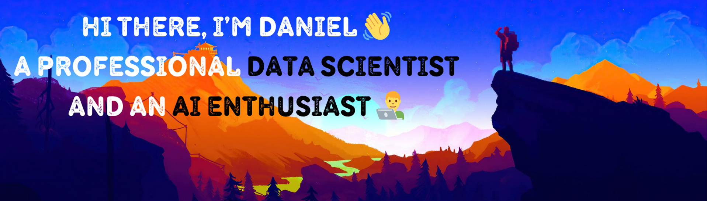

#  Welcome to My GitHub Profile

<!-- 

-->
<!-- Personal WEB-->

<!--
**dnlmoreno/dnlmoreno** is a ✨ _special_ ✨ repository because its `README.md` (this file) appears on your GitHub profile.
-->

## 👨🏻‍💻 About me

Currently working at [ALeRCE](https://alerce.science), one of the seven official brokers in the world selected to process real-time alerts from the Vera C. Rubin Observatory, which hosts the largest camera ever built and generates ~20 TB of data every night.

My work focuses on applying machine learning to astronomical time series and multimodal data, especially through transformer-based models. I have also served as a Research Fellow at Harvard SEAS, exploring vision and vision-language transformers for astronomy.

I’m currently learning more about the startup ecosystem and large-scale generative AI applications and agents automation. Always open to contributing to high-impact research and collaborative projects.

<!-- My projects-->

## 🛠️ Technologies

## 🚀 Featured Projects [In preparation]

Explore them on my [personal website](https://dnlmoreno.github.io).

## 📧 Contact 

📫 **Feel free to contact me at**: damoreno.cartagena@gmail.com  